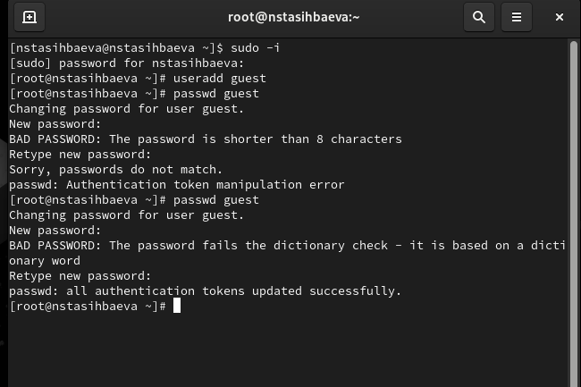
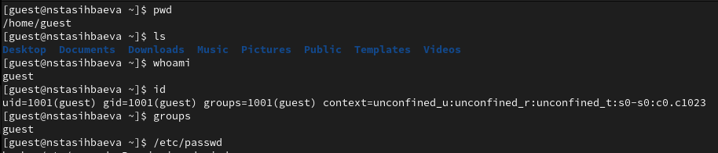
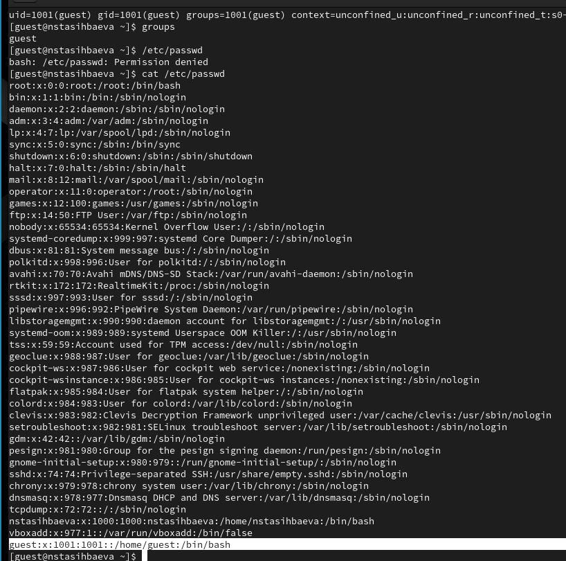
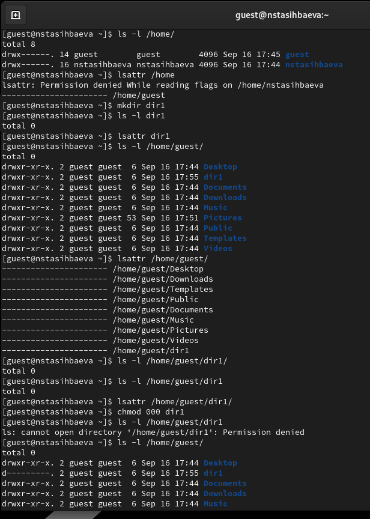
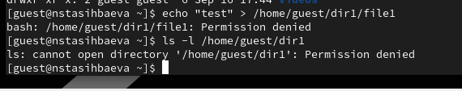

---
## Front matter
lang: ru-RU
title: Презентация лабораторной работы №2
subtitle: "Дискреционное разграничение прав в Linux. Основные атрибуты"
author:
  - Тасыбаева Н.С.
institute:
  - Российский университет дружбы народов, Москва, Россия
date: 16 сентября 2023

## i18n babel
babel-lang: russian
babel-otherlangs: english

## Formatting pdf
toc: false
toc-title: Содержание
slide_level: 2
aspectratio: 169
section-titles: true
theme: metropolis
header-includes:
 - \metroset{progressbar=frametitle,sectionpage=progressbar,numbering=fraction}
 - '\makeatletter'
 - '\beamer@ignorenonframefalse'
 - '\makeatother'
---

# Цели и задачи работы


Получение практических навыков работы в консоли с атрибутами файлов, закрепление теоретических основ дискреционного разграничения доступа в современных системах 
с открытым кодом на базе ОС Linux.

## Результаты

{ #fig:001 width=60% height=60% }


## Результаты

{ #fig:002 width=60% height=60% }

## Результаты

{ #fig:002 width=60% height=60% }

## Результаты

{ #fig:002 width=60% height=60% }

## Результаты

{ #fig:002 width=60% height=60% }

## Результаты

{ #fig:002 width=60% height=60% }

## Результаты

: Минимальные права для совершения операций 

|Операция|Права на директорию|Права на файл|
|:---:|:---:|:---:|
|Создание файла|```d-wx------ (300)```|```---------- (000)```|	    
|Удаление файла|```d-wx------ (300)```|```---------- (000)```|
|Чтение файла|```d--x------ (100)```|```-r-------- (400)```|
|Запись в файл|```d--x------ (100)```|```--w------- (200)```|
|Переименование файла|```d-wx------ (300)```|```----------(000)```|
|Создание поддиректории|```d-wx------ (300)```|```---------- (000)```|
|Удаление поддиректории|```d-wx------ (300)```|```---------- (000)```|


# Выводы по проделанной работе

В ходе выполнения лабораторной работы были получены навыки работы с атрибутами файлов и сведения о разграничении доступа.
