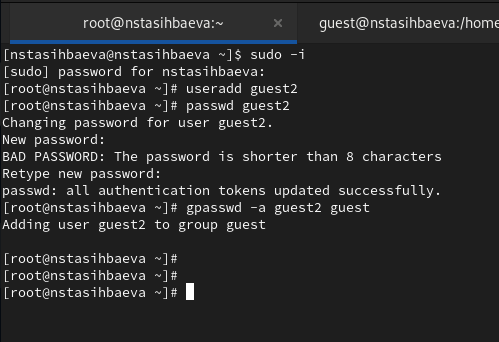
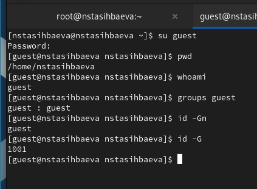
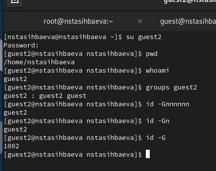
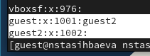
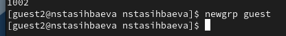
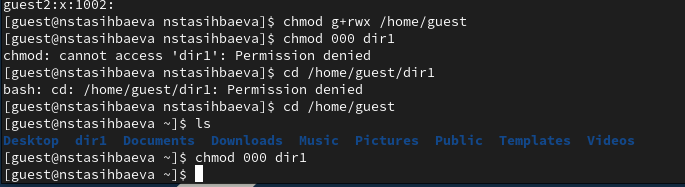

---
## Front matter
lang: ru-RU
title: Презентация лабораторной работы №2
subtitle: "Дискреционное разграничение прав в Linux. Основные атрибуты"
author:
  - Тасыбаева Н.С.
institute:
  - Российский университет дружбы народов, Москва, Россия
date: 16 сентября 2023

## i18n babel
babel-lang: russian
babel-otherlangs: english

## Formatting pdf
toc: false
toc-title: Содержание
slide_level: 2
aspectratio: 169
section-titles: true
theme: metropolis
header-includes:
 - \metroset{progressbar=frametitle,sectionpage=progressbar,numbering=fraction}
 - '\makeatletter'
 - '\beamer@ignorenonframefalse'
 - '\makeatother'
---

# Цели и задачи работы


Получение практических навыков работы в консоли с атрибутами файлов для групп пользователей.

## Результаты

{ #fig:001 width=70% height=70% }


## Результаты

{ #fig:002 width=70% height=70% }

## Результаты

{ #fig:003 width=70% height=70% }

## Результаты

{ #fig:004 width=70% height=70% }

## Результаты

{ #fig:005 width=70% height=70% }

## Результаты

{ #fig:006 width=70% height=70% }

## Результаты

: Минимальные права для совершения операций {#tbl:min-rig}

|        Операция        | Права на директорию | Права на файл |
|------------------------|---------------------------------|---------------------------|
|     Создание файла     |           ```d----wx--- (030)```      |      ```---------- (000)```     |	    
|     Удаление файла     |           ```d----wx--- (030)```      |      ```---------- (000)```     |
|      Чтение файла      |           ```d-----x--- (010)```      |      ```----r----- (040)```     |
|      Запись в файл     |           ```d-----x--- (010)```      |      ```-----w---- (020)```     |
|  Переименование файла  |           ```d----wx--- (030)```      |      ```---------- (000)```     |
| Создание поддиректории |           ```d----wx--- (030)```      |      ```---------- (000)```     |
| Удаление поддиректории |           ```d----wx--- (030)```      |      ```---------- (000)```     |


# Выводы по проделанной работе

В ходе выполнения работы, мы приобрели практические навыки работы в консоли с атрибутами файлов для групп пользователей.
