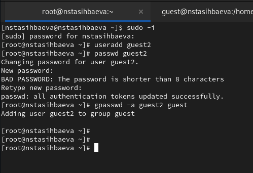
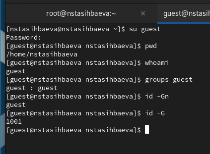
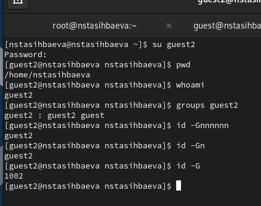
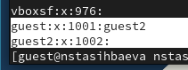
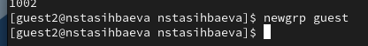
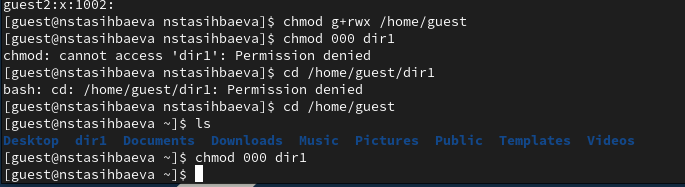

---
## Front matter
title: "Лабораторная работа №3"
subtitle: "Дискреционное
разграничение прав в Linux. Два пользователя"
author: "Тасыбаева Наталья Сергеевна"

## Generic otions
lang: ru-RU
toc-title: "Содержание"

## Bibliography
bibliography: bib/cite.bib
csl: pandoc/csl/gost-r-7-0-5-2008-numeric.csl

## Pdf output format
toc: true # Table of contents
toc-depth: 2
lof: true # List of figures
lot: true # List of tables
fontsize: 12pt
linestretch: 1.5
papersize: a4
documentclass: scrreprt
## I18n polyglossia
polyglossia-lang:
  name: russian
  options:
	- spelling=modern
	- babelshorthands=true
polyglossia-otherlangs:
  name: english
## I18n babel
babel-lang: russian
babel-otherlangs: english
## Fonts
mainfont: PT Serif
romanfont: PT Serif
sansfont: PT Sans
monofont: PT Mono
mainfontoptions: Ligatures=TeX
romanfontoptions: Ligatures=TeX
sansfontoptions: Ligatures=TeX,Scale=MatchLowercase
monofontoptions: Scale=MatchLowercase,Scale=0.9
## Biblatex
biblatex: true
biblio-style: "gost-numeric"
biblatexoptions:
  - parentracker=true
  - backend=biber
  - hyperref=auto
  - language=auto
  - autolang=other*
  - citestyle=gost-numeric
## Pandoc-crossref LaTeX customization
figureTitle: "Рис."
tableTitle: "Таблица"
listingTitle: "Листинг"
lofTitle: "Список иллюстраций"
lotTitle: "Список таблиц"
lolTitle: "Листинги"
## Misc options
indent: true
header-includes:
  - \usepackage{indentfirst}
  - \usepackage{float} # keep figures where there are in the text
  - \floatplacement{figure}{H} # keep figures where there are in the text
---

# Цель работы

Получение практических навыков работы в консоли с атрибутами файлов для групп пользователей.

# Выполнение лабораторной работы

1. В установленной операционной системе при выполнении предыдущей лабораторной работы мы создали учётную запись пользователя guest (использую учётную запись администратора), задали пароль для пользователя.
Аналогичным образом мы создали пользователя guest2 и задали ему пароль, а также добавили нового пользователя в группу guest(Рис. @fig:001)

{ #fig:001 width=70% height=70% }

2. Осуществиkb вход в систему от двух пользователей на двух разных консолях: guest (Рис. @fig:002) на первой консоли и guest2 на второй консоли (Рис. @fig:003).
Для обоих пользователей командой pwd определиkb директорию, в которой находимся. Сравнили её с приглашениями командной строки.
Уточнили имя пользователя (whoami), его группу (groups), кто входит в неё
и к каким группам принадлежит он сам. Определили командами
groups guest и groups guest2, в какие группы входят пользователи guest и guest2. Сравните вывод команды groups с выводом команд
id -Gn и id -G.

{ #fig:002 width=70% height=70% }
{ #fig:003 width=70% height=70% }

3. Сравните полученную информацию с содержимым файла /etc/group.
Просмотрите файл (Рис. @fig:004).

{ #fig:004 width=70% height=70% }

4. . От имени пользователя guest2 выполнили регистрацию пользователя
guest2 в группе guest. (Рис. @fig:005)

{ #fig:005 width=70% height=70% }

5. От имени пользователя guest изменили права директории /home/guest,
разрешив все действия для пользователей группы. 
От имени пользователя guest сняли с директории /home/guest/dir1
все атрибуты (Рис. @fig:006).

{ #fig:006 width=70% height=70% }

6. Заполнили таблицу (@tbl:rig-act) .   

1- Создание файла

2- Удаление файла

3- Запись в файл

4- Чтение файла

5- Смена директории

6- Просмотр файлов в директории

7- Переименование файла

8- Смена атрибутов файла


: Установленные права и разрешённые действия для групп {#tbl:rig-act}

|Права директории|Права файла|1|2|3|4|5|6|7|8|
|------------------|-------------|-------|-----|------|-------|------------|-----------|---------|------------|
|```---------``` (000)|```---------``` (000)| - | - | - | - | - | - | - | - |
|```---------``` (000)|```-----x---``` (010)| - | - | - | - | - | - | - | - |
|```---------``` (000)|```----w----``` (020)| - | - | - | - | - | - | - | - |
|```---------``` (000)|```----wx---``` (030)| - | - | - | - | - | - | - | - |
|```---------``` (000)|```---r-----``` (040)| - | - | - | - | - | - | - | - |
|```---------``` (000)|```---r-x---``` (050)| - | - | - | - | - | - | - | - |
|```---------``` (000)|```---rw----``` (060)| - | - | - | - | - | - | - | - |
|```---------``` (000)|```---rwx---``` (070)| - | - | - | - | - | - | - | - |
|```-----x---``` (010)|```---------``` (000)| - | - | - | - | + | - | - | - |
|```-----x---``` (010)|```-----x---``` (010)| - | - | - | - | + | - | - | - |
|```-----x---``` (010)|```----w----``` (020)| - | - | + | - | + | - | - | - |
|```-----x---``` (010)|```----wx---``` (030)| - | - | + | - | + | - | - | - |
|```-----x---``` (010)|```---r-----``` (040)| - | - | - | + | + | - | - | + |
|```-----x---``` (010)|```---r-x---``` (050)| - | - | - | + | + | - | - | + |
|```-----x---``` (010)|```---rw----``` (060)| - | - | + | + | + | - | - | + |
|```-----x---``` (010)|```---rwx---``` (070)| - | - | + | + | + | - | - | + |
|```----w----``` (020)|```---------``` (000)| - | - | - | - | - | - | - | - |
|```----w----``` (020)|```-----x---``` (010)| - | - | - | - | - | - | - | - |
|```----w----``` (020)|```----w----``` (020)| - | - | - | - | - | - | - | - |
|```----w----``` (020)|```----wx---``` (030)| - | - | - | - | - | - | - | - |
|```----w----``` (020)|```---r-----``` (040)| - | - | - | - | - | - | - | - |
|```----w----``` (020)|```---r-x---``` (050)| - | - | - | - | - | - | - | - |
|```----w----``` (020)|```---rw----``` (060)| - | - | - | - | - | - | - | - |
|```----w----``` (020)|```---rwx---``` (070)| - | - | - | - | - | - | - | - |
|```----wx---``` (030)|```---------``` (000)| + | + | - | - | + | - | + | - |
|```----wx---``` (030)|```-----x---``` (010)| + | + | - | - | + | - | + | - |
|```----wx---``` (030)|```----w----``` (020)| + | + | + | - | + | - | + | - |
|```----wx---``` (030)|```----wx---``` (030)| + | + | + | - | + | - | + | - |
|```----wx---``` (030)|```---r-----``` (040)| + | + | - | + | + | - | + | + |
|```----wx---``` (030)|```---r-x---``` (050)| + | + | - | + | + | - | + | + |
|```----wx---``` (030)|```---rw----``` (060)| + | + | + | + | + | - | + | + |
|```----wx---``` (030)|```---rwx---``` (070)| + | + | + | + | + | - | + | + |
|```---r-----``` (040)|```---------``` (000)| - | - | - | - | - | + | - | - |
|```---r-----``` (040)|```-----x---``` (010)| - | - | - | - | - | + | - | - |
|```---r-----``` (040)|```----w----``` (020)| - | - | - | - | - | + | - | - |
|```---r-----``` (040)|```----wx---``` (030)| - | - | - | - | - | + | - | - |
|```---r-----``` (040)|```---r-----``` (040)| - | - | - | - | - | + | - | - |
|```---r-----``` (040)|```---r-x---``` (050)| - | - | - | - | - | + | - | - |
|```---r-----``` (040)|```---rw----``` (060)| - | - | - | - | - | + | - | - |
|```---r-----``` (040)|```---rwx---``` (070)| - | - | - | - | - | + | - | - |
|```---r-x---``` (050)|```---------``` (000)| - | - | - | - | + | + | - | - |
|```---r-x---``` (050)|```-----x---``` (010)| - | - | - | - | + | + | - | - |
|```---r-x---``` (050)|```----w----``` (020)| - | - | + | - | + | + | - | - |
|```---r-x---``` (050)|```----wx---``` (030)| - | - | + | - | + | + | - | - |
|```---r-x---``` (050)|```---r-----``` (040)| - | - | - | + | + | + | - | + |
|```---r-x---``` (050)|```---r-x---``` (050)| - | - | - | + | + | + | - | + |
|```---r-x---``` (050)|```---rw----``` (060)| - | - | + | + | + | + | - | + |
|```---r-x---``` (050)|```---rwx---``` (070)| - | - | + | + | + | + | - | + |
|```---rw----``` (060)|```---------``` (000)| - | - | - | - | - | + | - | - |
|```---rw----``` (060)|```-----x---``` (010)| - | - | - | - | - | + | - | - |
|```---rw----``` (060)|```----w----``` (020)| - | - | - | - | - | + | - | - |
|```---rw----``` (060)|```----wx---``` (030)| - | - | - | - | - | + | - | - |
|```---rw----``` (060)|```---r-----``` (040)| - | - | - | - | - | + | - | - |
|```---rw----``` (060)|```---r-x---``` (050)| - | - | - | - | - | + | - | - |
|```---rw----``` (060)|```---rw----``` (060)| - | - | - | - | - | + | - | - |
|```---rw----``` (060)|```---rwx---``` (070)| - | - | - | - | - | + | - | - |
|```---rwx---``` (070)|```---------``` (000)| + | + | - | - | + | + | + | - |
|```---rwx---``` (070)|```-----x---``` (010)| + | + | - | - | + | + | + | - |
|```---rwx---``` (070)|```----w----``` (020)| + | + | + | - | + | + | + | - |
|```---rwx---``` (070)|```----wx---``` (030)| + | + | + | - | + | + | + | - |
|```---rwx---``` (070)|```---r-----``` (040)| + | + | - | + | + | + | + | + |
|```---rwx---``` (070)|```---r-x---``` (050)| + | + | - | + | + | + | + | + |
|```---rwx---``` (070)|```---rw----``` (060)| + | + | + | + | + | + | + | + |
|```---rwx---``` (070)|```---rwx---``` (070)| + | + | + | + | + | + | + | + |


5. На основании заполненной таблицы я определила те или иные минимально необходимые права для выполнения пользователем guest2 операций внутри директории dir1 
и заполнила таблицу [-@tbl:min-rig]. Для заполнения последних двух строк опытным путем проверила минимальные права для создания и удаления поддиректории.

: Минимальные права для совершения операций {#tbl:min-rig}

|        Операция        | Права на директорию | Права на файл |
|------------------------|---------------------------------|---------------------------|
|     Создание файла     |           ```d----wx--- (030)```      |      ```---------- (000)```     |	    
|     Удаление файла     |           ```d----wx--- (030)```      |      ```---------- (000)```     |
|      Чтение файла      |           ```d-----x--- (010)```      |      ```----r----- (040)```     |
|      Запись в файл     |           ```d-----x--- (010)```      |      ```-----w---- (020)```     |
|  Переименование файла  |           ```d----wx--- (030)```      |      ```---------- (000)```     |
| Создание поддиректории |           ```d----wx--- (030)```      |      ```---------- (000)```     |
| Удаление поддиректории |           ```d----wx--- (030)```      |      ```---------- (000)```     |

Сравнивая таблицу 3.1. с такой же таблицей из предыдущей лабораторной работы, могу сказать, что они одинаковы. Единственное различие только в том, что в предыдущий раз я присваивала права владельцу, а в этот раз группе.

# Вывод

В ходе выполнения работы, мы приобрели практические навыки работы в консоли с атрибутами файлов для групп пользователей.

# Список используемой литературы {.unnumberd}
