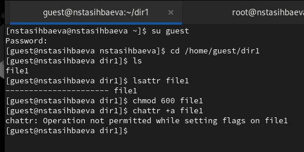
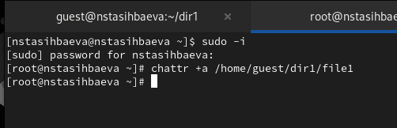
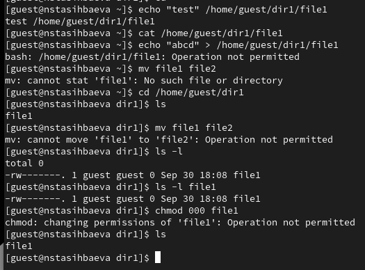
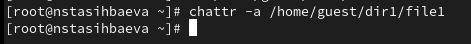
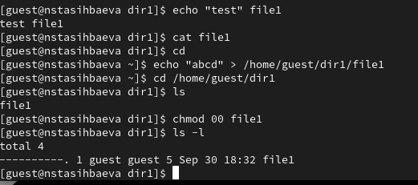
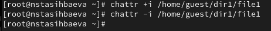

---
## Front matter
lang: ru-RU
title: Презентация лабораторной работы №4
subtitle: "Дискреционное
разграничение прав в Linux. Расширенные
атрибуты"
author:
  - Тасыбаева Н.С.
institute:
  - Российский университет дружбы народов, Москва, Россия
date: 30 сентября 2023

## i18n babel
babel-lang: russian
babel-otherlangs: english

## Formatting pdf
toc: false
toc-title: Содержание
slide_level: 2
aspectratio: 169
section-titles: true
theme: metropolis
header-includes:
 - \metroset{progressbar=frametitle,sectionpage=progressbar,numbering=fraction}
 - '\makeatletter'
 - '\beamer@ignorenonframefalse'
 - '\makeatother'
---

# Цели и задачи работы

Получение практических навыков работы в консоли с расширенными
атрибутами файлов.

## Результаты

{ #fig:001 width=70% height=70% }

## Результаты

{ #fig:002 width=70% height=70% }

## Результаты

{ #fig:003 width=70% height=70% }

## Результаты

{ #fig:004 width=70% height=70% }

## Результаты

{ #fig:005 width=70% height=70% }

## Результаты

{ #fig:005 width=70% height=70% }

## Результаты

{ #fig:005 width=70% height=70% }

## Результаты

{ #fig:006 width=70% height=70% }

# Выводы по проделанной работе

В результате выполнения работы мы повысили свои навыки использования интерфейса командой строки (CLI), познакомились на примерах с тем,
как используются основные и расширенные атрибуты при разграничении
доступа. Имели возможность связать теорию дискреционного разделения
доступа (дискреционная политика безопасности) с её реализацией на практике в ОС Linux.
