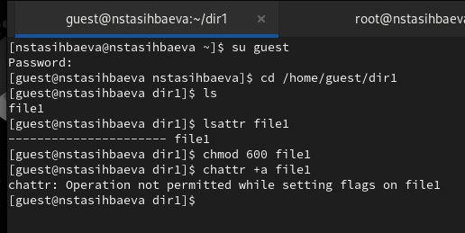
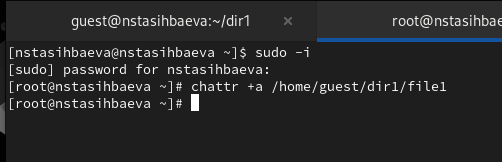
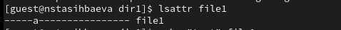
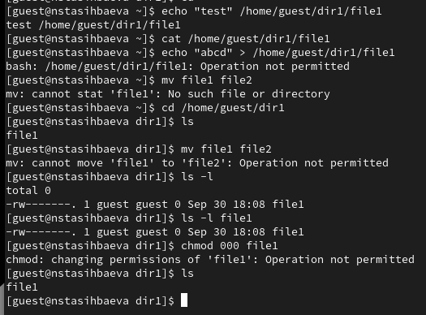
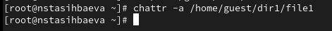
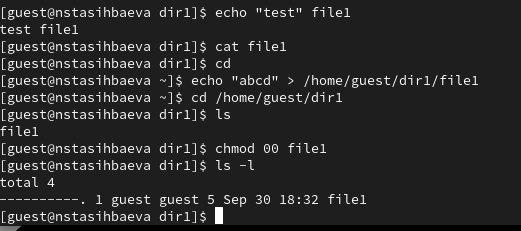
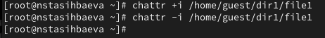
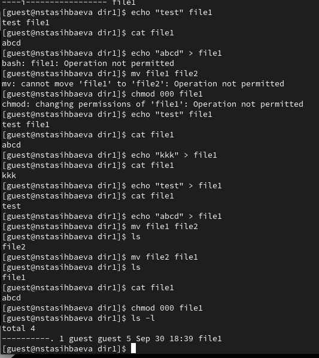

---
## Front matter
title: "Лабораторная работа №4"
subtitle: "Дискреционное
разграничение прав в Linux. Расширенные
атрибуты"
author: "Тасыбаева Наталья Сергеевна"

## Generic otions
lang: ru-RU
toc-title: "Содержание"

## Bibliography
bibliography: bib/cite.bib
csl: pandoc/csl/gost-r-7-0-5-2008-numeric.csl

## Pdf output format
toc: true # Table of contents
toc-depth: 2
lof: true # List of figures
lot: true # List of tables
fontsize: 12pt
linestretch: 1.5
papersize: a4
documentclass: scrreprt
## I18n polyglossia
polyglossia-lang:
  name: russian
  options:
	- spelling=modern
	- babelshorthands=true
polyglossia-otherlangs:
  name: english
## I18n babel
babel-lang: russian
babel-otherlangs: english
## Fonts
mainfont: PT Serif
romanfont: PT Serif
sansfont: PT Sans
monofont: PT Mono
mainfontoptions: Ligatures=TeX
romanfontoptions: Ligatures=TeX
sansfontoptions: Ligatures=TeX,Scale=MatchLowercase
monofontoptions: Scale=MatchLowercase,Scale=0.9
## Biblatex
biblatex: true
biblio-style: "gost-numeric"
biblatexoptions:
  - parentracker=true
  - backend=biber
  - hyperref=auto
  - language=auto
  - autolang=other*
  - citestyle=gost-numeric
## Pandoc-crossref LaTeX customization
figureTitle: "Рис."
tableTitle: "Таблица"
listingTitle: "Листинг"
lofTitle: "Список иллюстраций"
lotTitle: "Список таблиц"
lolTitle: "Листинги"
## Misc options
indent: true
header-includes:
  - \usepackage{indentfirst}
  - \usepackage{float} # keep figures where there are in the text
  - \floatplacement{figure}{H} # keep figures where there are in the text
---

# Цель работы

Получение практических навыков работы в консоли с расширенными
атрибутами файлов.

# Выполнение лабораторной работы

1. От имени пользователя guest определили расширенные атрибуты файла
/home/guest/dir1/file1.
Установили на файл file1 права, разрешающие чтение и запись для владельца файла.
Попробовали установить на файл /home/guest/dir1/file1 расширенный атрибут a от имени пользователя guest.(Рис. @fig:001)
Получили отказ от операции.

{ #fig:001 width=70% height=70% }

2. На второй консоли попробовали установить расширенный атрибут a на файл /home/guest/dir1/file1 от имени суперпользователя (Рис. @fig:002) 
От пользователя guest проверили правильность установления атрибут (Рис. @fig:003). 
Выполнили дозапись в файл file1 слова «test». После этого выполнили чтение файла file1 командой. Попробовали удалить файл file1 либо стереть имеющуюся в нём информацию. Попробовали переименовать файл. Попробовали установить на файл file1 права, например, запрещающие чтение и запись для владельца файла.
(Рис. @fig:004).

{ #fig:002 width=70% height=70% }
{ #fig:003 width=70% height=70% }
{ #fig:004 width=70% height=70% }

3. Сняли расширенный атрибут a с файла /home/guest/dirl/file1 от
имени суперпользователя (Рис. @fig:004).
Повторили операции, которые ранее не удавалось выполнить (Рис. @fig:005).

{ #fig:004 width=70% height=70% }
{ #fig:005 width=70% height=70% }

4. На второй консоли попробовали установить расширенный атрибут i на файл /home/guest/dir1/file1 от имени суперпользователя (позже сняли данный атрибут) (Рис. @fig:006)

{ #fig:006 width=70% height=70% }

5. Повторили ваши действия по шагам, заменив атрибут «a» атрибутом «i». Все наблюдения прокомментированы в скринкасте.
(Рис. @fig:007).

{ #fig:007 width=70% height=70% }

# Вывод

В результате выполнения работы мы повысили свои навыки использования интерфейса командой строки (CLI), познакомились на примерах с тем,
как используются основные и расширенные атрибуты при разграничении
доступа. Имели возможность связать теорию дискреционного разделения
доступа (дискреционная политика безопасности) с её реализацией на практике в ОС Linux.

# Список используемой литературы {.unnumberd}
