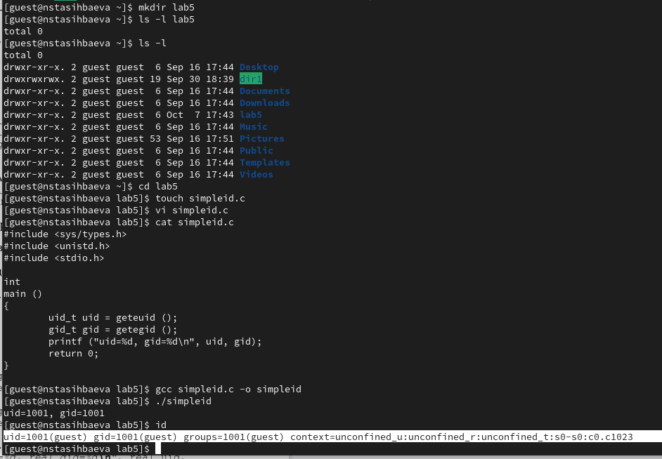
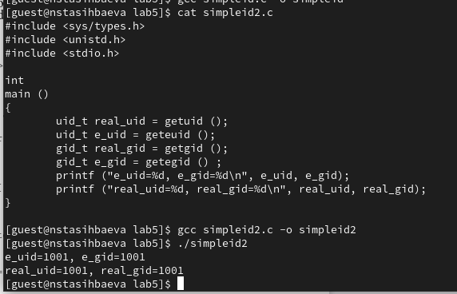
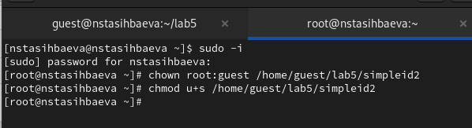
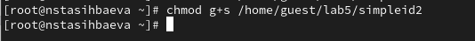
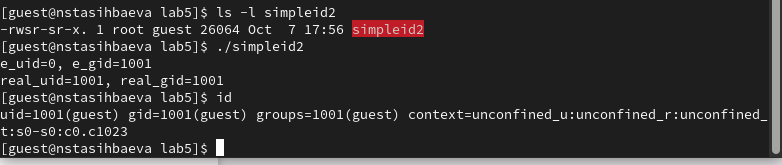
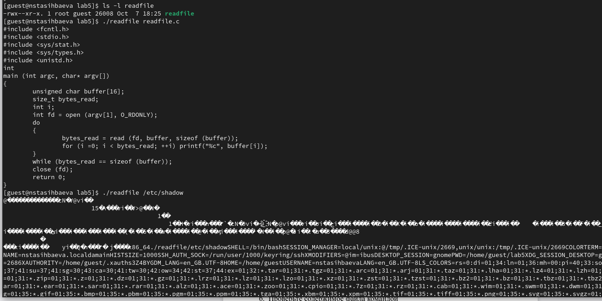
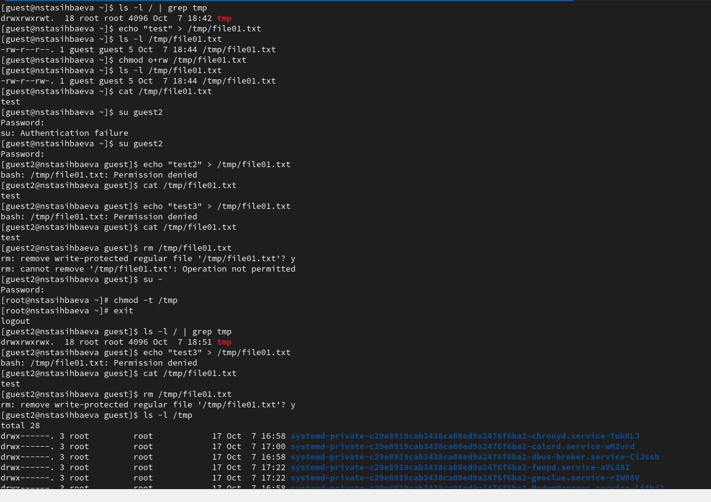
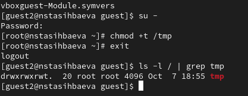

---
## Front matter
lang: ru-RU
title: Презентация лабораторной работы №5
subtitle: "Дискреционное
разграничение прав в Linux. Исследование
влияния дополнительных атрибутов"
author:
  - Тасыбаева Н.С.
institute:
  - Российский университет дружбы народов, Москва, Россия
date: 7 октября 2023

## i18n babel
babel-lang: russian
babel-otherlangs: english

## Formatting pdf
toc: false
toc-title: Содержание
slide_level: 2
aspectratio: 169
section-titles: true
theme: metropolis
header-includes:
 - \metroset{progressbar=frametitle,sectionpage=progressbar,numbering=fraction}
 - '\makeatletter'
 - '\beamer@ignorenonframefalse'
 - '\makeatother'
---

# Цели и задачи работы

Изучение механизмов изменения идентификаторов, применения
SetUID- и Sticky-битов. Получение практических навыков работы в консоли с дополнительными атрибутами. Рассмотрение работы механизма
смены идентификатора процессов пользователей, а также влияние бита
Sticky на запись и удаление файлов.

## Результаты

{ #fig:001 width=70% height=70% }

## Результаты

{ #fig:002 width=70% height=70% }

## Результаты

{ #fig:003 width=70% height=70% }

## Результаты

{ #fig:004 width=70% height=70% }

## Результаты

{ #fig:004 width=70% height=70% }

## Результаты

{ #fig:005 width=70% height=70% }

## Результаты

{ #fig:006 width=70% height=70% }

## Результаты

{ #fig:007 width=70% height=70% }

## Результаты

{ #fig:008 width=70% height=70% }

# Выводы по проделанной работе

Я изучила механизмы изменения идентификаторов, применения SetUID- и Sticky-битов, получила практические навыки работы в консоли с дополнительными атрибутами. Рассмотрела работу механизма смены идентификатора процессов пользователей, а также влияние бита Sticky на запись и удаление файлов.
