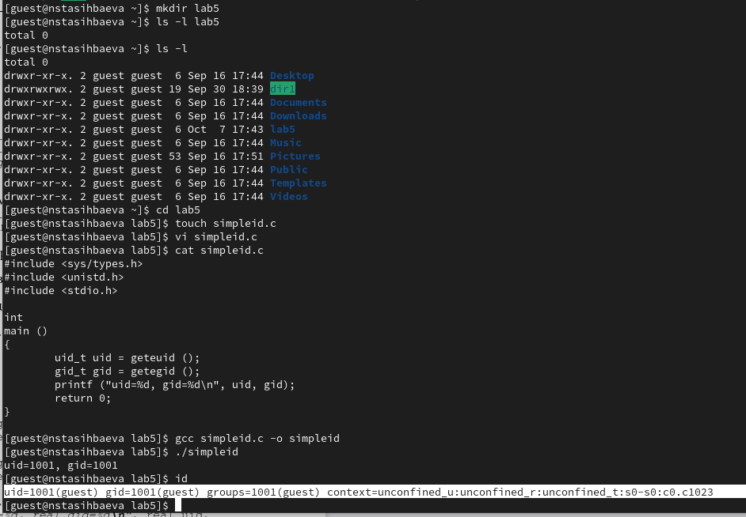
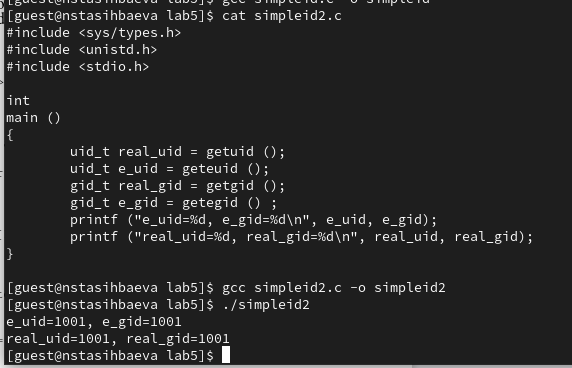
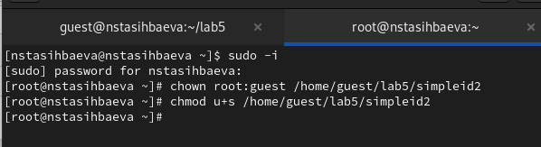
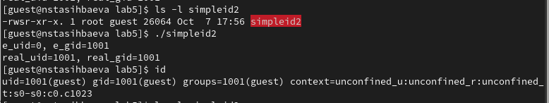
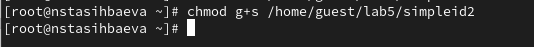
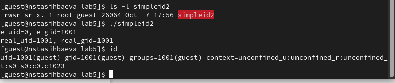
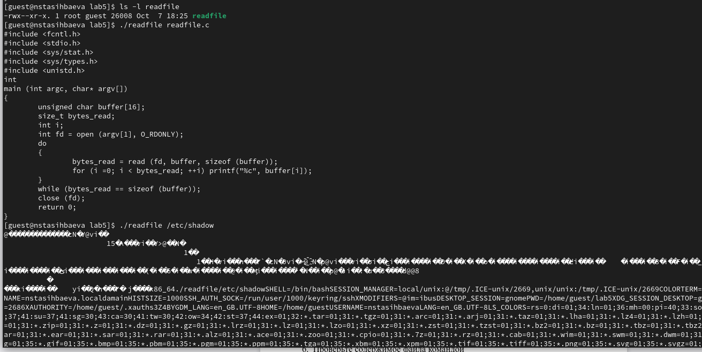
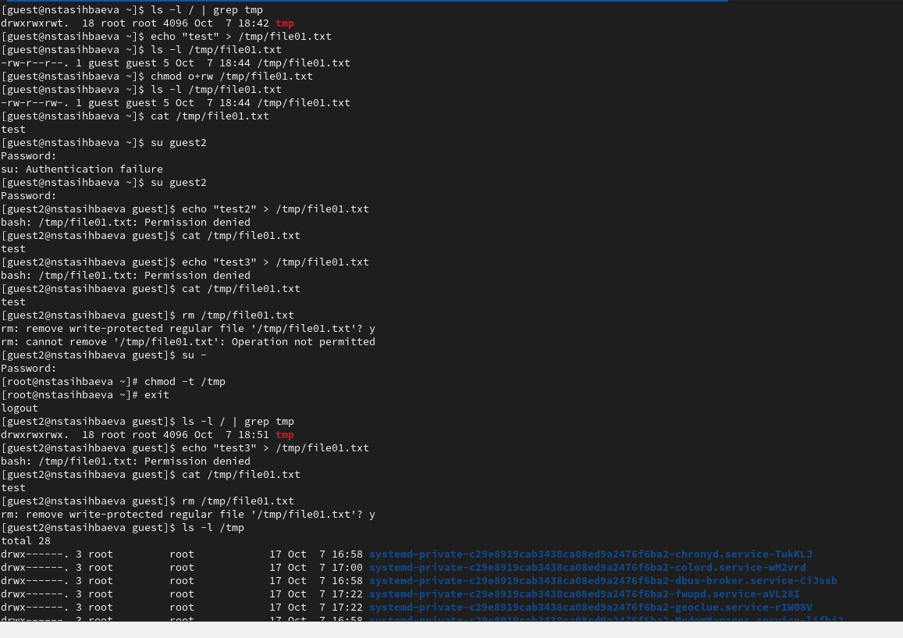
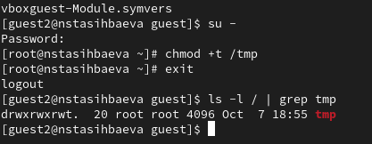

---
## Front matter
title: "Лабораторная работа №5"
subtitle: "Дискреционное
разграничение прав в Linux. Исследование
влияния дополнительных атрибутов"
author: "Тасыбаева Наталья Сергеевна"

## Generic otions
lang: ru-RU
toc-title: "Содержание"

## Bibliography
bibliography: bib/cite.bib
csl: pandoc/csl/gost-r-7-0-5-2008-numeric.csl

## Pdf output format
toc: true # Table of contents
toc-depth: 2
lof: true # List of figures
lot: true # List of tables
fontsize: 12pt
linestretch: 1.5
papersize: a4
documentclass: scrreprt
## I18n polyglossia
polyglossia-lang:
  name: russian
  options:
	- spelling=modern
	- babelshorthands=true
polyglossia-otherlangs:
  name: english
## I18n babel
babel-lang: russian
babel-otherlangs: english
## Fonts
mainfont: PT Serif
romanfont: PT Serif
sansfont: PT Sans
monofont: PT Mono
mainfontoptions: Ligatures=TeX
romanfontoptions: Ligatures=TeX
sansfontoptions: Ligatures=TeX,Scale=MatchLowercase
monofontoptions: Scale=MatchLowercase,Scale=0.9
## Biblatex
biblatex: true
biblio-style: "gost-numeric"
biblatexoptions:
  - parentracker=true
  - backend=biber
  - hyperref=auto
  - language=auto
  - autolang=other*
  - citestyle=gost-numeric
## Pandoc-crossref LaTeX customization
figureTitle: "Рис."
tableTitle: "Таблица"
listingTitle: "Листинг"
lofTitle: "Список иллюстраций"
lotTitle: "Список таблиц"
lolTitle: "Листинги"
## Misc options
indent: true
header-includes:
  - \usepackage{indentfirst}
  - \usepackage{float} # keep figures where there are in the text
  - \floatplacement{figure}{H} # keep figures where there are in the text
---

# Цель работы

Изучение механизмов изменения идентификаторов, применения
SetUID- и Sticky-битов. Получение практических навыков работы в консоли с дополнительными атрибутами. Рассмотрение работы механизма
смены идентификатора процессов пользователей, а также влияние бита
Sticky на запись и удаление файлов.

# Выполнение лабораторной работы

1. От имени пользователя guest создали е программу simpleid.c, скомпилировали её и убедились, что файл программы создан. Выполнили программу и выполнили систему. программу id. Сравнили результаты - они идентичны. (Рис. @fig:001)

{ #fig:001 width=70% height=70% }

2. Создали программу simpleid2.c, усложнив первую (добавив вывод действительных идентификаторов), скомпилировали её и запустили.(Рис. @fig:002) 

От имени суперпользователя сменили владельца и изменили права на simpleid2.c (Рис. @fig:003). 

Выполнили проверку правильности установки новых атрибутов и смены
владельца файла simpleid2. Запустили simpleid2 и id и сравнили результаты: идентичны.
(Рис. @fig:004).

{ #fig:002 width=70% height=70% }
{ #fig:003 width=70% height=70% }
{ #fig:004 width=70% height=70% }

3. Проделали тоже самое относительно SetGID-бита.
Сперва изменили права файла(Рис. @fig:004).
Затем повторили операции(Рис. @fig:005).

{ #fig:004 width=70% height=70% }
{ #fig:005 width=70% height=70% }

4. Создали программу readfile.c. и откомпилировали её.
Сменили владельца у файла readfile.c и изменили права так, чтобы только суперпользователь (root) мог прочитать его, a guest не мог.
Проверили, может ли программа readfile прочитать файл readfile.c.
Проверили, может ли программа readfile прочитать файл /etc/shadow.
(Рис. @fig:006)

{ #fig:006 width=70% height=70% }

5.  Исследование Sticky-бита (Рис. @fig:007) (Рис. @fig:008).

{ #fig:007 width=70% height=70% }

{ #fig:008 width=70% height=70% }

# Вывод

Я изучила механизмы изменения идентификаторов, применения SetUID- и Sticky-битов, получила практические навыки работы в консоли с дополнительными атрибутами. Рассмотрела работу механизма смены идентификатора процессов пользователей, а также влияние бита Sticky на запись и удаление файлов.

# Список используемой литературы {.unnumberd}
