---
## Front matter
lang: ru-RU
title: Презентация лабораторной работы №6
subtitle: "Мандатное
разграничение прав в Linux"
author:
  - Тасыбаева Н.С.
institute:
  - Российский университет дружбы народов, Москва, Россия
date: 14 октября 2023

## i18n babel
babel-lang: russian
babel-otherlangs: english

## Formatting pdf
toc: false
toc-title: Содержание
slide_level: 2
aspectratio: 169
section-titles: true
theme: metropolis
header-includes:
 - \metroset{progressbar=frametitle,sectionpage=progressbar,numbering=fraction}
 - '\makeatletter'
 - '\beamer@ignorenonframefalse'
 - '\makeatother'
---

# Цели и задачи работы

Развить навыки администрирования ОС Linux. Получить первое практическое знакомство с технологией SELinux1.
Проверить работу SELinx на практике совместно с веб-сервером
Apache.

## Результаты

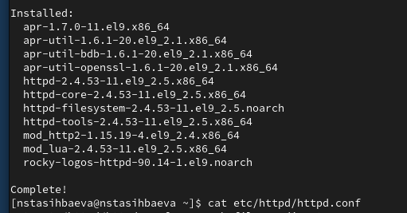{#fig:001 width=70%}

## Результаты

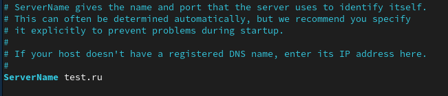{#fig:002 width=70%}

## Результаты

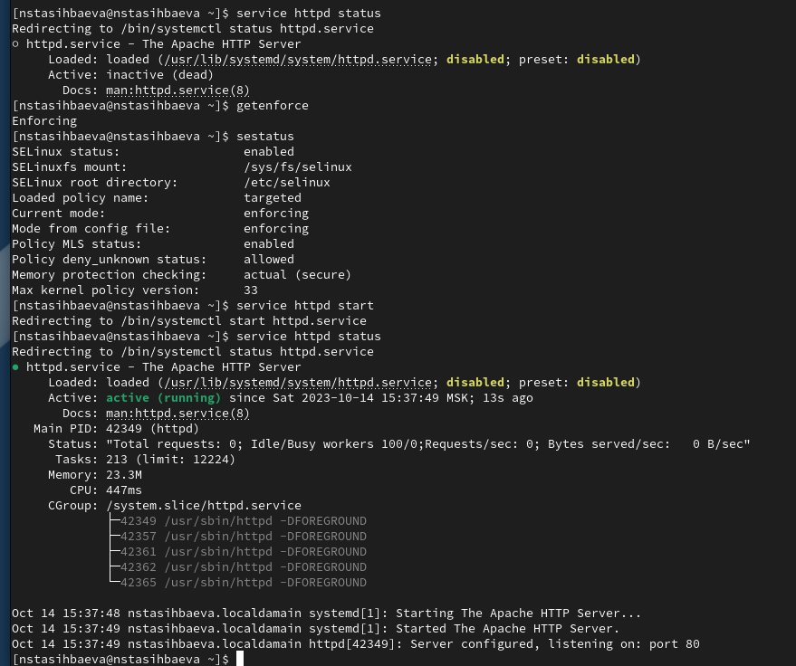{#fig:003 width=70%}

## Результаты

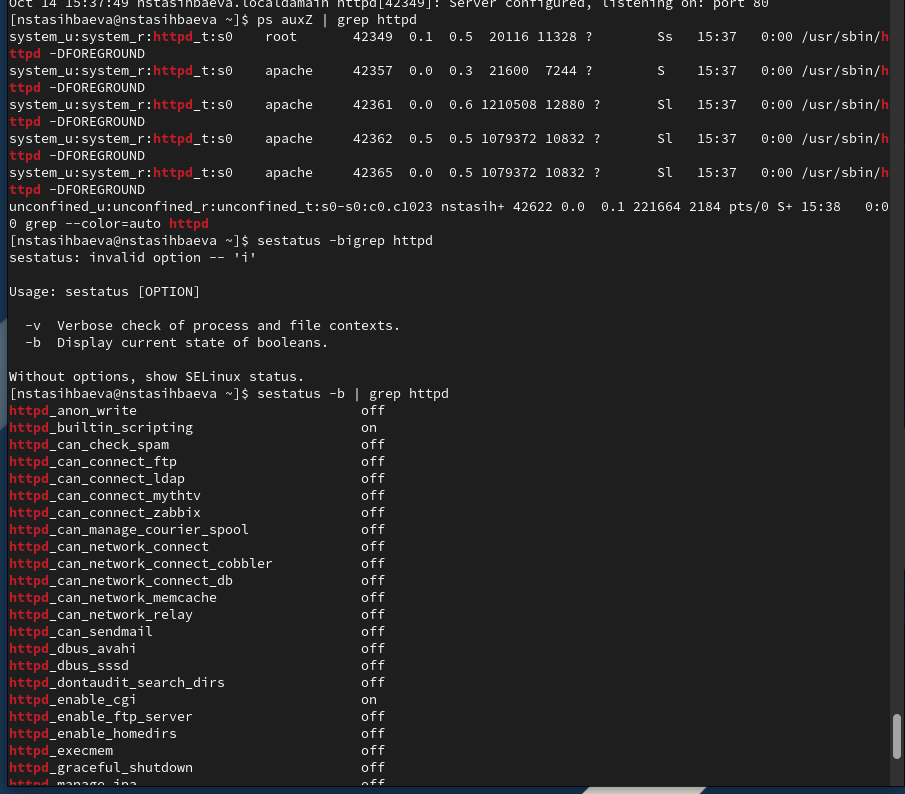{#fig:004 width=70%}

## Результаты

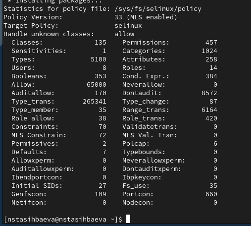{#fig:005 width=70%}

## Результаты

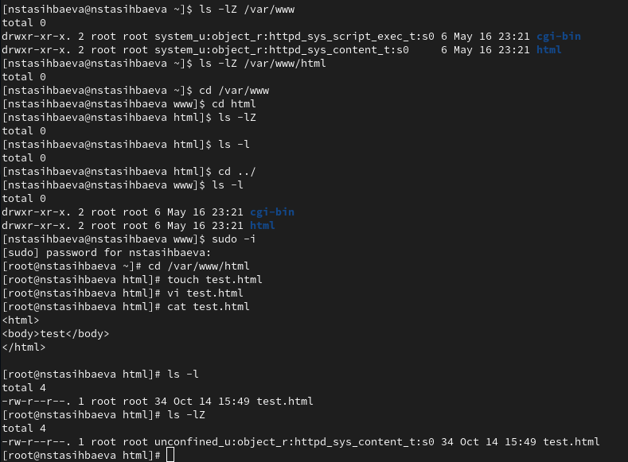{#fig:006 width=70%}

## Результаты

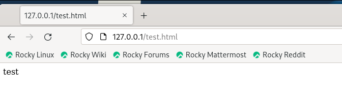{#fig:007 width=70%}

## Результаты

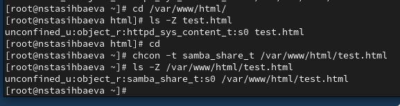{#fig:008 width=70%}

## Результаты

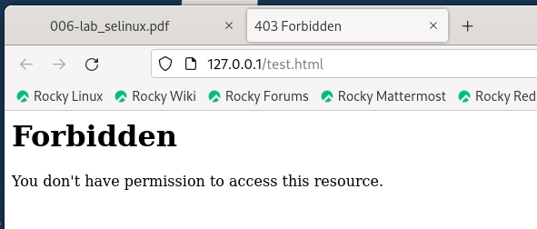{#fig:009 width=70%}

## Результаты

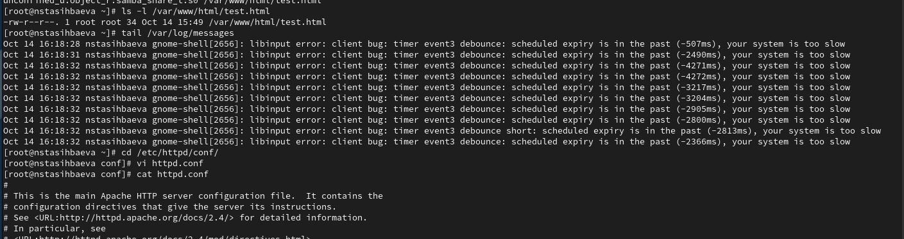{#fig:010 width=70%}

## Результаты

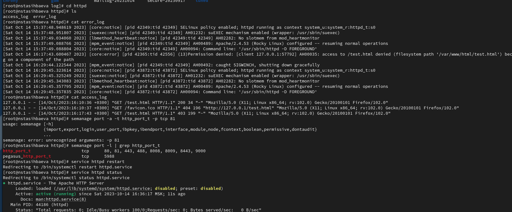{#fig:011 width=70%}

## Результаты

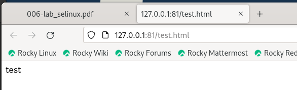{#fig:012 width=70%}

## Результаты

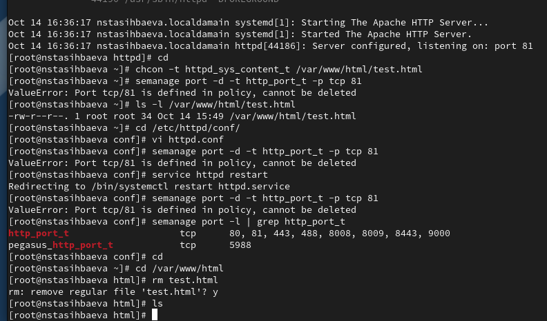{#fig:013 width=70%}

# Выводы по проделанной работе

Я изучила механизмы изменения идентификаторов, применения SetUID- и Sticky-битов, получила практические навыки работы в консоли с дополнительными атрибутами. Рассмотрела работу механизма смены идентификатора процессов пользователей, а также влияние бита Sticky на запись и удаление файлов.
