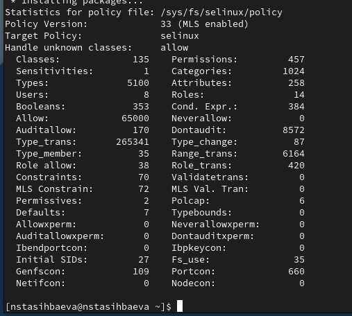

---
## Front matter
title: "Лабораторная работа №6"
subtitle: "Мандатное
разграничение прав в Linux"
author: "Тасыбаева Наталья Сергеевна"

## Generic otions
lang: ru-RU
toc-title: "Содержание"

## Bibliography
bibliography: bib/cite.bib
csl: pandoc/csl/gost-r-7-0-5-2008-numeric.csl

## Pdf output format
toc: true # Table of contents
toc-depth: 2
lof: true # List of figures
lot: true # List of tables
fontsize: 12pt
linestretch: 1.5
papersize: a4
documentclass: scrreprt
## I18n polyglossia
polyglossia-lang:
  name: russian
  options:
	- spelling=modern
	- babelshorthands=true
polyglossia-otherlangs:
  name: english
## I18n babel
babel-lang: russian
babel-otherlangs: english
## Fonts
mainfont: PT Serif
romanfont: PT Serif
sansfont: PT Sans
monofont: PT Mono
mainfontoptions: Ligatures=TeX
romanfontoptions: Ligatures=TeX
sansfontoptions: Ligatures=TeX,Scale=MatchLowercase
monofontoptions: Scale=MatchLowercase,Scale=0.9
## Biblatex
biblatex: true
biblio-style: "gost-numeric"
biblatexoptions:
  - parentracker=true
  - backend=biber
  - hyperref=auto
  - language=auto
  - autolang=other*
  - citestyle=gost-numeric
## Pandoc-crossref LaTeX customization
figureTitle: "Рис."
tableTitle: "Таблица"
listingTitle: "Листинг"
lofTitle: "Список иллюстраций"
lotTitle: "Список таблиц"
lolTitle: "Листинги"
## Misc options
indent: true
header-includes:
  - \usepackage{indentfirst}
  - \usepackage{float} # keep figures where there are in the text
  - \floatplacement{figure}{H} # keep figures where there are in the text
---

# Цель работы

Развить навыки администрирования ОС Linux. Получить первое практическое знакомство с технологией SELinux1.
Проверить работу SELinx на практике совместно с веб-сервером
Apache.

# Выполнение лабораторной работы

1. Установила веб-сервис apache для дальнейшей работы (рис. @fig:001).

{#fig:001 width=70%}

2. В конфигурационном файле /etc/httpd/httpd.conf задала параметр ServerName (рис. @fig:002).

{#fig:002 width=70%}

3. Вошла в систему с полученными учётными данными и убедилась, что
SELinux работает в режиме enforcing политики targeted с помощью команд getenforce и sestatus. Запустила веб-сервис (рис. @fig:003). 

{#fig:003 width=70%}

4. Определила его контест безопасности. Посмотрела текущее состояние переключателей SELinux (рис. @fig:004)

{#fig:004 width=70%}

5. Посмотрела статистику по политике с помощью команды seinfo (рис. @fig:005)

{#fig:005 width=70%}

6. Определила тип файлов и поддиректорий, находящихся в директории
/var/www, определила тип файлов, находящихся в директории /var/www/html, определил круг пользователей, которым разрешено создание файлов в
директории /var/www/html. Создала от имени суперпользователя html-файл test.html. Проверила контекст созданного вами файла. Занесите в отчёт контекст,
присваиваемый по умолчанию вновь созданным файлам в директории /var/www/html. Обратился к файлу через веб-сервер (рис. @fig:006, @fig:007)

{#fig:006 width=70%}

{#fig:007 width=70%}

7. Изменила контекст файла /var/www/html/test.html с
httpd_sys_content_t на любой другой, к которому процесс httpd не
должен иметь доступа, попробовала ещё раз получить доступ к файлу через веб-сервер (рис. @fig:008, @fig:009).

{#fig:008 width=70%}

{#fig:009 width=70%}

9. Просмотрела log-файлы веб-сервера Apache (рис. @fig:010)

{#fig:010 width=70%}

10. Открыл файл через 81 порт (рис. @fig:011, @fig:0112, @fig:0113)

{#fig:011 width=70%}

{#fig:012 width=70%}

{#fig:013 width=70%}

# Выводы

Я развила навыки администрирования ОС Linux. Получила первое практическое знакомство с технологией SELinux, а также проверила работу SELinux на практике совместно с веб-сервером Apache.

# Список используемой литературы {.unnumberd}
