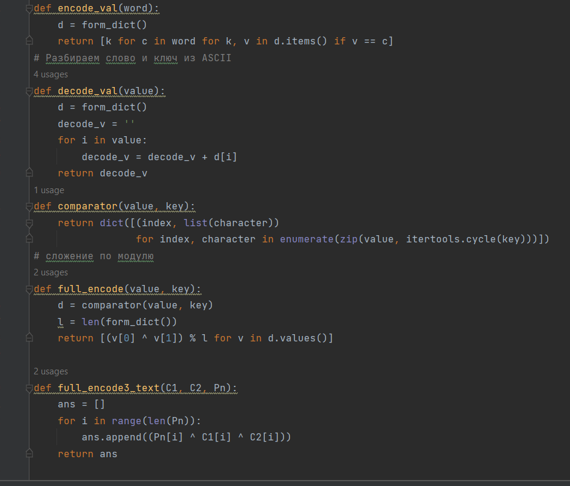
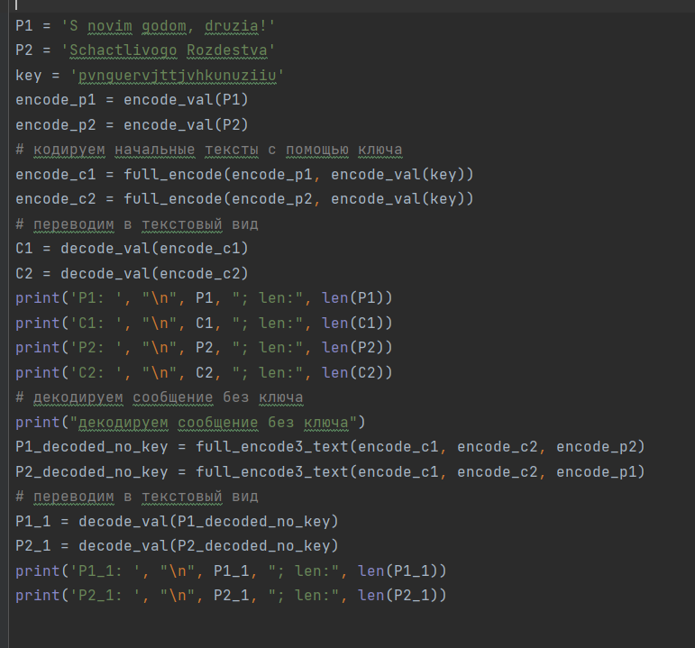
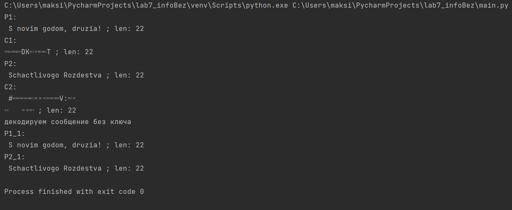

---
## Front matter
title: "Лабораторная работа №8"
subtitle: "Элементы криптографии. Шифрование (кодирование) различных исходных текстов одним ключом"
author: "Тасыбаева Наталья Сергеевна"

## Generic otions
lang: ru-RU
toc-title: "Содержание"

## Bibliography
bibliography: bib/cite.bib
csl: pandoc/csl/gost-r-7-0-5-2008-numeric.csl

## Pdf output format
toc: true # Table of contents
toc-depth: 2
lof: true # List of figures
lot: true # List of tables
fontsize: 12pt
linestretch: 1.5
papersize: a4
documentclass: scrreprt
## I18n polyglossia
polyglossia-lang:
  name: russian
  options:
	- spelling=modern
	- babelshorthands=true
polyglossia-otherlangs:
  name: english
## I18n babel
babel-lang: russian
babel-otherlangs: english
## Fonts
mainfont: PT Serif
romanfont: PT Serif
sansfont: PT Sans
monofont: PT Mono
mainfontoptions: Ligatures=TeX
romanfontoptions: Ligatures=TeX
sansfontoptions: Ligatures=TeX,Scale=MatchLowercase
monofontoptions: Scale=MatchLowercase,Scale=0.9
## Biblatex
biblatex: true
biblio-style: "gost-numeric"
biblatexoptions:
  - parentracker=true
  - backend=biber
  - hyperref=auto
  - language=auto
  - autolang=other*
  - citestyle=gost-numeric
## Pandoc-crossref LaTeX customization
figureTitle: "Рис."
tableTitle: "Таблица"
listingTitle: "Листинг"
lolTitle: "Листинги"
## Misc options
indent: true
header-includes:
  - \usepackage{indentfirst}
  - \usepackage{float} # keep figures where there are in the text
  - \floatplacement{figure}{H} # keep figures where there are in the text
---

# Цель работы

Освоить на практике применение режима однократного гаммирования
на примере кодирования различных исходных текстов одним ключом.

# Задание

Два текста кодируются одним ключом (однократное гаммирование).
Требуется не зная ключа и не стремясь его определить, прочитать оба текста. Необходимо разработать приложение, позволяющее шифровать и дешифровать тексты P1 и P2 в режиме однократного гаммирования. Приложение должно определить вид шифротекстов C1 и C2 обоих текстов P1 и
P2 при известном ключе ; Необходимо определить и выразить аналитически способ, при котором злоумышленник может прочитать оба текста, не
зная ключа и не стремясь его определить.

# Теоретическое введение

Гаммирование представляет собой наложение (снятие) на открытые (зашифрованные) данные последовательности элементов других данных, полученной с помощью некоторого криптографического алгоритма, для получения зашифрованных (открытых) данных. Иными словами, наложение
гаммы — это сложение её элементов с элементами открытого (закрытого)
текста по некоторому фиксированному модулю, значение которого представляет собой известную часть алгоритма шифрования.
В соответствии с теорией криптоанализа, если в методе шифрования используется однократная вероятностная гамма (однократное гаммирование)
той же длины, что и подлежащий сокрытию текст, то текст нельзя раскрыть.
Даже при раскрытии части последовательности гаммы нельзя получить информацию о всём скрываемом тексте.
Наложение гаммы по сути представляет собой выполнение операции
сложения по модулю 2 (XOR) (обозначаемая знаком ⊕) между элементами
гаммы и элементами подлежащего сокрытию текста. Напомним, как работает операция XOR над битами: $$ 0 ⊕ 0 = 0, 0 ⊕ 1 = 1, 1 ⊕ 0 = 1, 1 ⊕ 1 = 0.  $$
Такой метод шифрования является симметричным, так как двойное прибавление одной и той же величины по модулю 2 восстанавливает исходное значение, а шифрование и расшифрование выполняется одной и той же программой[@1].

# Выполнение лабораторной работы

Написала программу, реализующее задание (рис. @fig:001, @fig:002, @fig:003).

{#fig:001 width=70%}

{#fig:002 width=70%}

{#fig:003 width=70%}

# Выводы

Я освоила на практике применение режима однократного гаммирования
на примере кодирования различных исходных текстов одним ключом.

# Ответы на контрольные вопросы

Однократное гаммирование (также известное как шифр Вернама или шифр по модулю 2) является методом шифрования, который использует одноразовый ключ, который должен быть такой же длины, что и шифруемый текст. Ответим на ваши вопросы:

1. Как, зная один из текстов (P1 или P2), определить другой, не зная при этом ключа?

Если вы знаете один из открытых текстов (P1 или P2) и соответствующий ему зашифрованный текст (C1 или C2), и у вас нет ключа, вы не сможете определить другой открытый текст. Однократное гаммирование обеспечивает сильную криптографическую защиту, если ключ используется только один раз.

2. Что будет при повторном использовании ключа при шифровании текста?

Повторное использование ключа при однократном гаммировании полностью компрометирует шифрование. Если ключ используется повторно, злоумышленный анализатор может просто выполнить операцию XOR между зашифрованным текстом и известным текстом, чтобы получить оригинальный ключ, и затем использовать этот ключ для расшифровки других сообщений, зашифрованных с тем же ключом.

3. Как реализуется режим шифрования однократного гаммирования одним ключом двух открытых текстов?

В однократном гаммировании каждому биту открытого текста соответствует бит ключа. Операция XOR выполняется между открытым текстом и ключом, чтобы получить зашифрованный текст. Если вы хотите зашифровать два разных открытых текста (P1 и P2) с использованием одного и того же ключа, вы просто выполняете операцию XOR между каждым открытым текстом и ключом по отдельности.

4. Перечислите недостатки шифрования одним ключом двух открытых текстов.

Основными недостатками шифрования одним ключом двух открытых текстов (повторное использование ключа) являются:
- Уязвимость к криптоанализу при многократном использовании ключа.
- Невозможность безопасного обмена ключами для секретной передачи.
- Ограничение на длину ключа, который должен быть такой же длины, что и открытый текст.

5. Перечислите преимущества шифрования одним ключом двух открытых текстов.

Преимущества такого шифрования ограничены и обычно не рекомендуются. Однако можно выделить следующие преимущества:
Простота реализации: Однократное гаммирование легко реализовать с использованием операции XOR.
Высокая скорость шифрования и дешифрования: Поскольку операция XOR быстрая, шифрование и дешифрование могут выполняться быстро.

# Список литературы{.unnumbered}

::: {#refs}
:::
